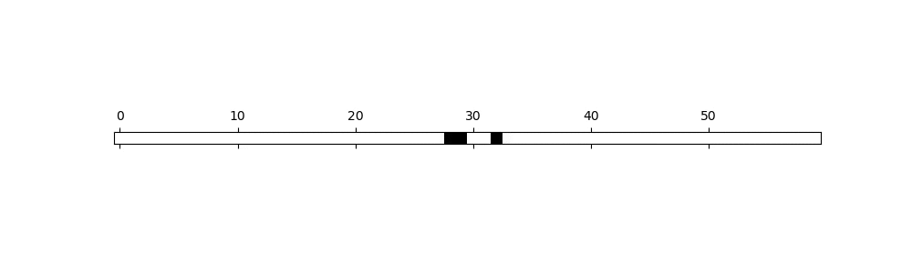
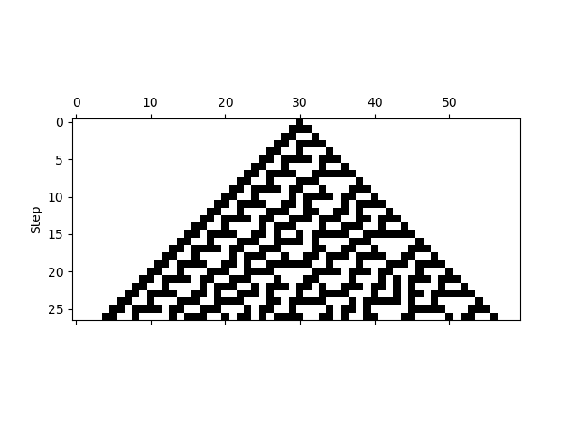
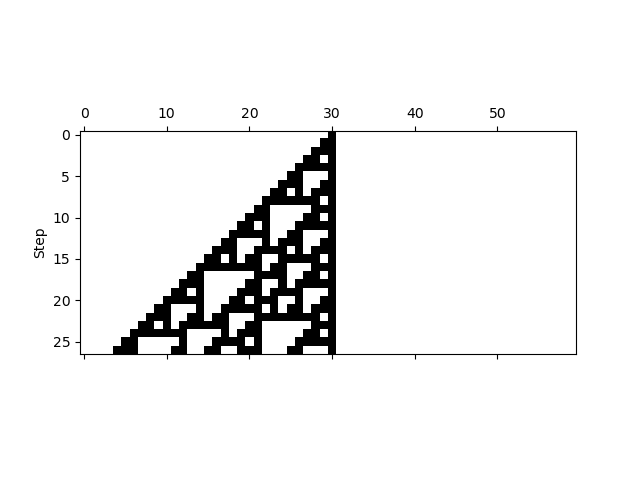
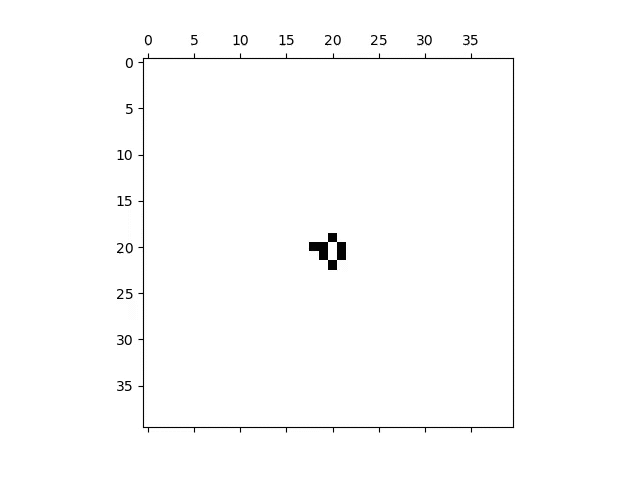

# Cellular Automata

Some simple examples of cellular automata. Nothing innovative, as of now.

## 1 Dimension

### Rule 30

Starting with one black center in the middle

History (first step is the top one)

### Rule 110

Starting with one black center in the middle

History (first step is the top one)

## 2 Dimensions

### Chaotic Game of Life

