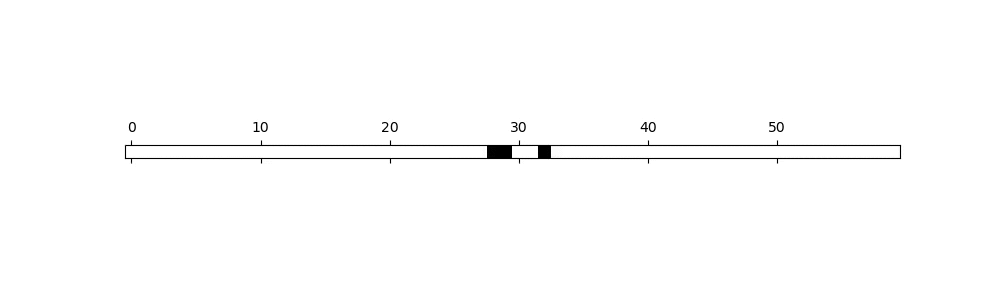
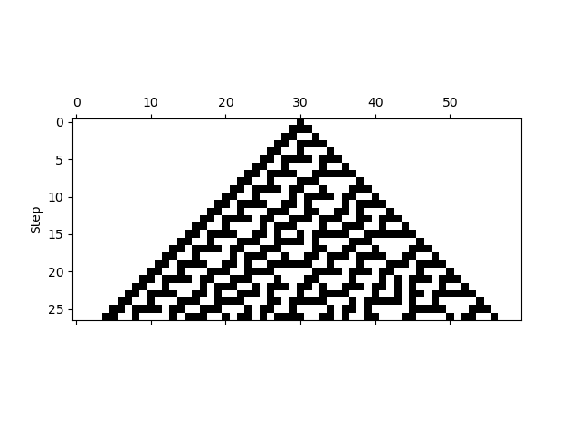
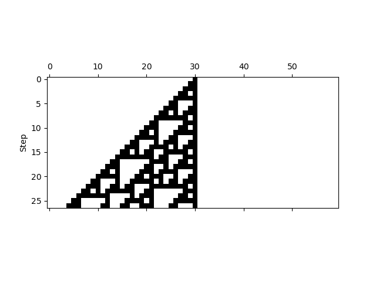
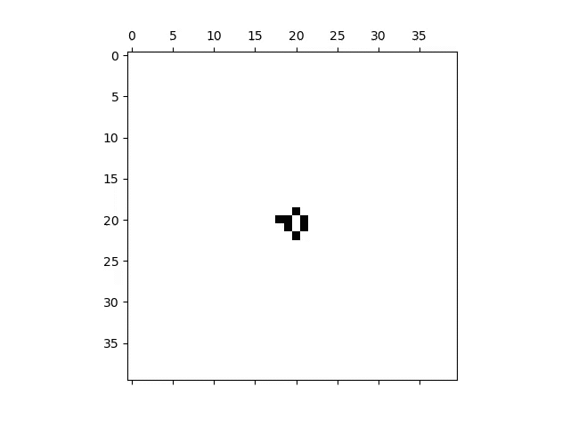

# Cellular Automata

Some simple examples of cellular automata. Nothing innovative, as of now.

## Demo

### 1 Dimension

#### Rule 30

Starting with one black center in the middle



History (first step is the top one)



#### Rule 110

Starting with one black center in the middle


History (first step is the top one)



### 2 Dimensions

#### Chaotic Game of Life




## Installation

```shell
git clone git@github.com:MartinBraquet/cellular-automata.git
cd cellular-automata
pip install -e "."
```

## Usage

Main usage:

```python
from cellular_automata import cellular_automaton, game_of_life

cellular_automaton(
    n_grid=60,  # number of tiles in the grid
    frames=100,  # number of frames (aka steps)
    rule=game_of_life, # type of evolution law
    initial_setup='chaos', # initial state
    interval=200, # interval between two steps (in milliseconds)
)
```

## Feedback

For any issue / bug report / feature request,
open an [issue](https://github.com/MartinBraquet/cellular-automata/issues).

Let us know if any of the following would be useful to you:
* Python package available on PyPI
* Web application to play with the simulations online

## Contributions

To provide upgrades or fixes, open a [pull request](https://github.com/MartinBraquet/cellular-automata/pulls).